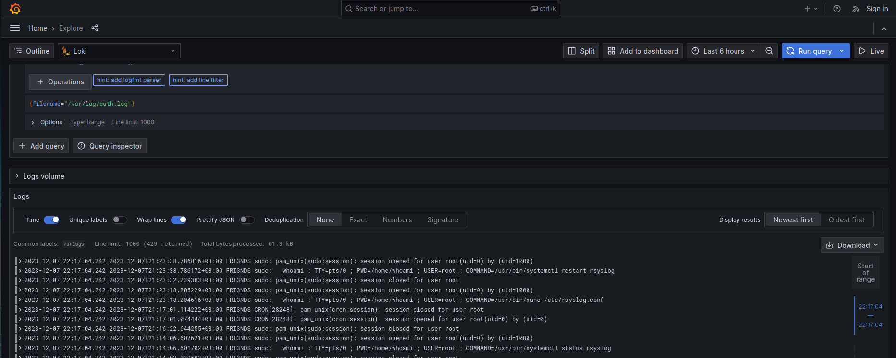

# Практическая работа 4 "Сбор логов"

## Сеников Михаил Олегович ББМО-02-23

### Добавление двух виртуальных машин в одну виртуальную сеть для обеспечения передачи даннх между ними

### Включение и настройка передачи логов с одной вм на другую
#### Запуск служб

#### настройка сервера. принимаем логи по tcp и udp из записывеам в папки сгруппированные по хосту->приложению 

#### указание правила пересылки логов на сервер

#### сохраненные логи на сервере

### Установка и настройка получения логов на сервер с использованием Loki и Grafana
#### отображение логов авторизации

### усткановка signoze
