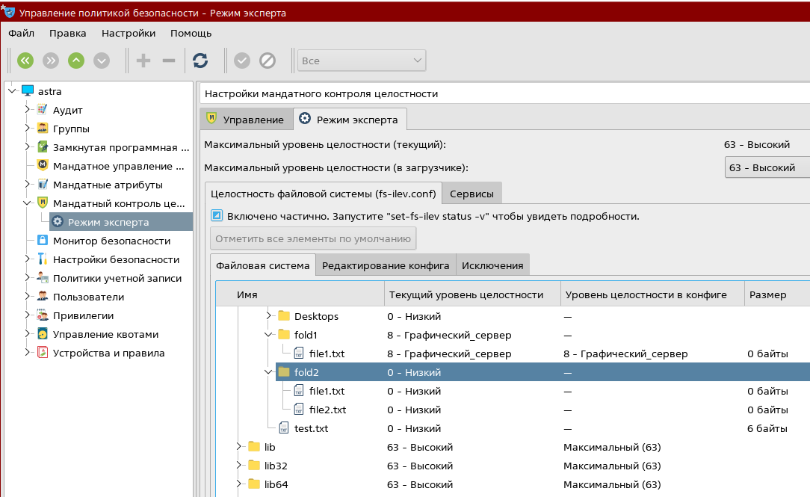
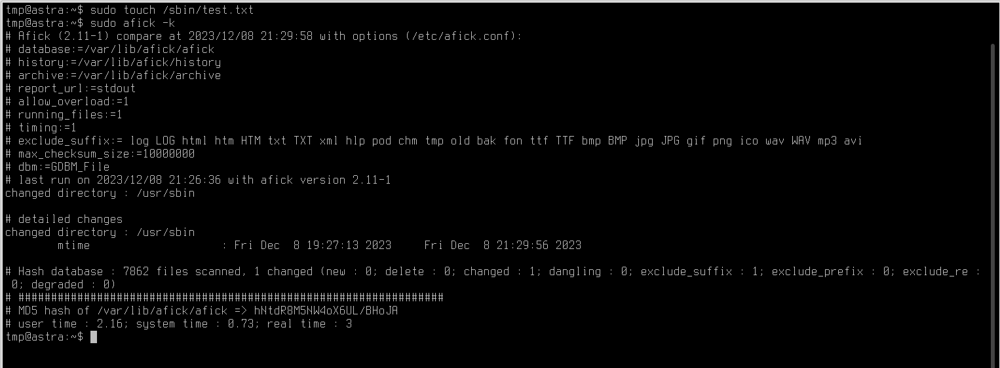

# ПРЗ 4.2 Контроль целостности

## Сеников Михаил Олегович ББМО-02-23

## Установка, настройка и проверка мандатного контроля целостности (МКЦ)

### включение мандатного контроля целостности

### при помощи управлении политиками безовасности назначили уровни целостности

### проверям только что сделаные настройки

### в результате мы видми что копирование файла с атрибутом ниже в папку с атрибутом выше не сработало - была получена ошибка доступа. В то же время "запись вниз" работает.

## Работа с режимом замкнутой программной среды (ЗПС)

### в качестве иполняемого файла я сдлелал bash файл, который просто выводит сообщение в консоли

### включение замкнутой программной среды

## Работа с утилитами контроля целостности и регламентного контроля целостности

## gostsum
### Утилита gostsum вычисляет хэш-сумму файлов в соответствии с ГОСТ Р 34.11-2012

## Afick

### Afick - это быстрая и доступная утилита, помогающая при обнаружении вторжений, а также позволяющая контролировать общую целостность системы.

### если изменить состояние файловой системы и повторно зааустить afick, то увидим что изменилось

